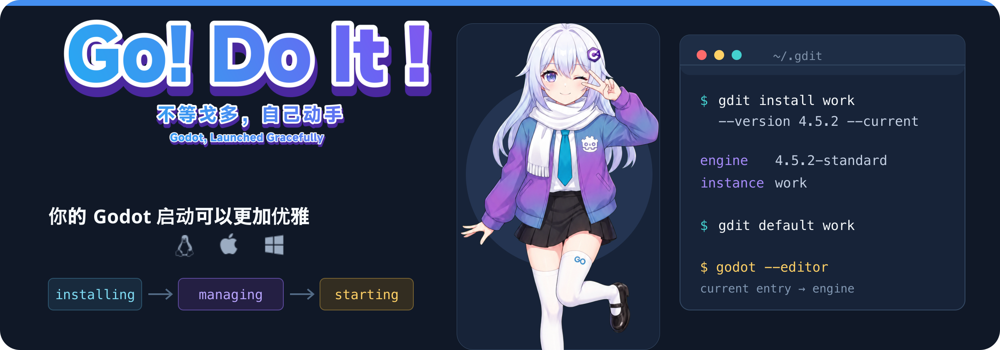

# GoDoIt

<p align="center">
  
</p>

<div align="center">
  
  <a href="./LICENSE"></a>
  
  
</div>

GoDoIt（够独特）是一个简单易用的 Godot 引擎启动器与版本管理器。它把引擎和 .NET SDK 当作可校验、可复用的资产，把启动配置保存为 instances 条目，让 `godot` 在任意目录都启动当前条目。

当前 `v0.2` 第六阶段已经完成 Linux 基础实现。阶段 A、B 的 GUI 工作流代码与自动测试已经落地，
包括候选后台预取与分类、配置层环境变量编辑、可跨 GUI 重启恢复的运行会话、全局会话面板与
实时事件。阶段 C 的版本身份、离线许可证、三平台归档和 GitHub Release 流程也已落地；Linux GUI
视觉验收、三平台发布 CI 首次实际运行，以及 macOS Apple Silicon / Windows x86_64 GUI 实机验证
仍待完成。

## 为什么用 GoDoIt

- **管理引擎，不绑定项目**：不在项目目录写 `.gdit`、TOML 或 lock，也不保存项目路径关联。
- **条目和资产分离**：引擎与 SDK 只安装一次，instances 只保存版本引用、SDK 策略和环境配置。
- **启动路径可预测**：`~/.gdit/current` 是全局当前条目；shim 和 `run` 不读项目、不访问网络。
- **安装可恢复**：下载先进入 `~/.gdit/tmp/`，摘要校验成功后才原子发布到 `engines/` 或 `sdks/`。
- **环境只作用于子进程**：DOTNET_ROOT、PATH 前缀、显示驱动和 fcitx 输入法配置不会修改 shell 或系统 dotnet。

## 获取 GoDoIt

[GitHub Releases](https://github.com/Sheyiyuan/GoDoIt/releases) 使用两个通道：稳定 tag
`v<VERSION>` 对应不可覆盖的稳定版，`dev-latest` 是随 `main` 更新的开发预发布。每次完整发布包含
Linux amd64、macOS arm64、Windows amd64 三个平台归档以及 `SHA256SUMS`；下载后应先校验摘要。

macOS 归档目前只做 ad-hoc 签名，尚未公证；Windows 归档尚未做 Authenticode 签名。两者仍属于
验证级产物。具体下载、校验和启动步骤见 [Wiki 安装指南](./wiki/src/content/wiki/how-to/install-godoit.md)。
如果 Release 页面尚无对应产物，请使用下面的源码构建方式。

## 快速开始

当前仓库提供源码构建方式。需要 Go 1.25.13 或更新版本，发布构建使用受支持的 Go 1.26.x。

```bash
make build
./bin/gdit available
./bin/gdit install work --version 4.5.2 --current
./bin/gdit setup
./bin/gdit run -- -e
```

`setup` 只创建 `~/.gdit/bin/godot` shim，不修改 shell 配置或系统 PATH。将该目录加入 PATH 后即可直接运行：

```bash
godot --editor
```

## 命令面

| 工作流 | 命令 |
| --- | --- |
| 安装启动条目 | `gdit install <name> --version <version>` |
| 查看和切换当前条目 | `gdit list`、`gdit default <name>` |
| 启动引擎 | `gdit run [<name>] -- <engine args>` |
| 启动桌面 GUI | `gdit gui [arguments]` |
| 查看构建版本 | `gdit version`、`gdit --version` |
| 配置环境 | `gdit env set KEY=VALUE`、`gdit env unset KEY` |
| 管理引擎资产 | `gdit engine list/install/remove` |
| 管理托管 SDK | `gdit sdk list/available/install/remove` |
| 清理孤儿资产 | `gdit autoremove --yes` |
| 管理下载来源 | `gdit source`、`gdit source use <name>` |
| 诊断本地环境 | `gdit doctor [--network] [--verbose]` |

完整命令参数见 [`docs/commands.md`](./docs/commands.md)，设计边界以 [`docs/architecture/README.md`](./docs/architecture/README.md) 为准。


第五阶段命令包括 `gdit suggest [项目目录]` 与 `gdit template ...`。其中 `suggest`
只会显式、只读分析 `project.godot`、`global.json` 和同目录 `.csproj`，不会保存项目路径、修改
项目目录或隐式改变 current；只有用户确认或显式传入 `--install` 后才进入安装流程。

## 数据布局

GoDoIt 的用户级数据默认放在 `~/.gdit/`，可用绝对路径环境变量 `GDIT_ROOT` 覆盖；项目目录不会被写入：

```text
~/.gdit/
├── config.toml       # 来源顺序与全局环境
├── state.toml        # 由 gdit 维护的资产索引
├── current           # Unix symlink / Windows 重定向文件，指向当前条目
├── instances/        # 启动条目：<uuid>.toml，显示名（可中文）存在文件内
├── engines/          # Godot 引擎资产
├── sdks/             # 托管 .NET SDK 资产
├── templates/        # 已验证的导出模板资产
├── runtime/sessions/ # GUI 启动的 Godot 运行会话登记
└── tmp/              # 下载和解压临时目录
```

## 平台与边界

| 平台 | 状态 |
| --- | --- |
| Linux amd64 | 主支持和 fixture 集成测试平台；原生归档已在 Linux 验证 |
| macOS arm64 | 验证级支持；原生 Apple Silicon CI 门禁已配置，待首次运行与实机验收 |
| Windows x86_64 | 验证级支持：`godot.cmd` shim、LockFileEx、MoveFileEx 原子写；WinBoat Windows 11 x86_64 原生验收已通过 |

当前发布候选已经覆盖引擎来源 fallback、SHA-256/SHA-512 校验、instances、环境注入、托管/系统 SDK、

资产 GC、`doctor`、三平台适配层、项目建议、导出模板，以及 Linux 上的 Wails GUI。

## 开发

```bash
make check       # 格式检查、测试和 go vet
make test-race   # 竞态检测
make build       # 构建 bin/gdit 与 gui/build/bin（macOS 为 GoDoIt.app）
make build-gui   # 只构建 Wails GUI；Linux WebKit 标签可用 WAILS_BUILD_TAGS 覆盖
make run         # 构建并启动 GUI
make run-cli list # 构建并启动 CLI；命令参数直接跟在 run-cli 后
make package-linux # 原生生成并复验 Linux amd64 发布归档
make release-checksums release-verify # 三平台归档齐备后生成摘要并做最终白名单校验
GOOS=darwin GOARCH=arm64 go build -trimpath -o /tmp/gdit-darwin-arm64 ./cli/cmd/gdit
```

测试使用固定 fixture，不以 live 网络测试替代来源和完整性测试。提交前请保持 Go 文件经过 `gofmt`，并确认项目目录没有被测试修改。

## 文档

- [命令参考](./docs/commands.md)
- [架构与阶段边界](./docs/architecture/README.md)
- [需求与 MVP 验收标准](./docs/requirements.md)
- [GUI 问题与 TODO 进度](./docs/bugs&todos.md)
- [发布维护手册](./docs/release.md)
- [Wiki 源码](./wiki/README.md)

## License

GoDoIt 以 GNU Affero General Public License v3.0 发布，详见 [`LICENSE`](./LICENSE)。
